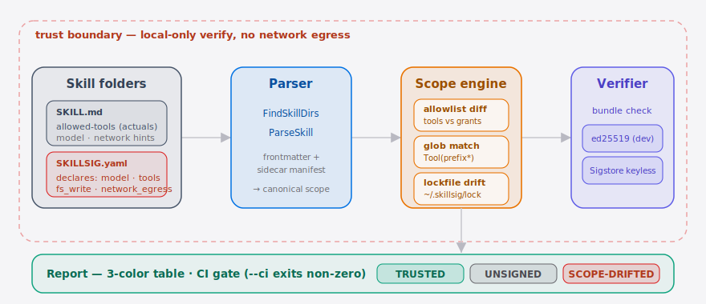

[English](./README.en.md) | **简体中文**

<p align="center">
  
</p>

<p align="center">
  <a href="https://github.com/SuperMarioYL/skillsig/actions/workflows/ci.yml"></a>
  <a href="https://github.com/SuperMarioYL/skillsig/releases"></a>
  <a href="./LICENSE"></a>
  
  
  
</p>

> **skillsig 是给 Claude Code Skill 做签名 + 权限漂移检测的命令行验证器。**
> 在 `claude skills update` 把更广的权限静悄悄拉进来之前，先在 CI 里把它拦住。

## 目录

- [为什么需要它](#为什么需要它)
- [60 秒上手](#60-秒上手)
- [演示](#演示)
- [核心概念：skillsig manifest](#核心概念skillsig-manifest)
- [对比：skillsig vs 既有方案](#对比skillsig-vs-既有方案)
- [配置一览](#配置一览)
- [发布到 CI](#发布到-ci)
- [路线图](#路线图)
- [付费版（v0.2）](#付费版v02)
- [贡献 & 许可](#贡献--许可)
- [Share this](#share-this)

---

## 为什么需要它

`ComposioHQ/awesome-claude-skills` 与 `sickn33/antigravity-awesome-skills`
两份清单合计 10 万星、1 494+ 个 Skill，每天还以约 280 颗星的速度往上涨。
[@affaan-m](https://github.com/affaan-m) 的 `everything-claude-code`
就是其中一份还在持续增长的合集。每一个 Skill 都是一段挂在 Claude Code 上的
prompt + 工具授权 + 文件系统/网络范围；`claude skills update` 会在用户下一次开会话时
默默拉回最新内容。2026 年 5 月 Ars Technica 报道的
**jqwik prompt-injection 事件** 已经把这种攻击落实到生产：一个被信任的开发包带毒上线，
让 AI 编码代理删用户的应用输出。

今天没有任何机制能回答：

- 我团队装的 Skill 里，哪些声明了对 `~/` 的写入？
- 上周我审过的那份 manifest，是不是就是刚才被拉下来的那份？
- 某个 Skill 在版本 0.3.0 之后，悄悄多加了一行 `Bash(rm -rf …)`，CI 能拦下来吗？

skillsig 就是来回答这三个问题的：声明范围的 YAML manifest，加上 Sigstore keyless 签名，
再加上 `~/.skillsig/lock.yaml` 跨版本权限漂移检测。

##  架构

<p align="center">
  <picture>
    <source media="(prefers-color-scheme: dark)" srcset="./assets/atlas-dark.svg">
    <source media="(prefers-color-scheme: light)" srcset="./assets/atlas-light.svg">
    
  </picture>
</p>

每个 Skill 目录有两份输入：`SKILL.md`（frontmatter 里是**实际生效**的 `allowed-tools`
授权），以及 `SKILLSIG.yaml`（**声明**意图范围的 manifest，四个轴：model · tools ·
fs_write · network_egress）。**parser** 把两者规范化，**scope 引擎**把声明白名单和实际
授权做 diff（带 `Tool(prefix*)` 通配语义），再和 `~/.skillsig/lock.yaml` 基线比对以捕获
跨版本漂移，**verifier** 校验 ed25519 或 Sigstore keyless 签名 bundle。整个流程全程本地、
不联网，最终落到一张三色**报告**表；带 `--ci` 时一旦出现范围扩张就返回非零退出码，让 CI
直接 fail，而不是事后才让人发现。

## 60 秒上手

```bash
# 1) 装 (macOS：Homebrew tap 即将上线；先用 go install)
go install github.com/SuperMarioYL/skillsig/cmd/skillsig@latest

# 2) 立刻看到它能干嘛（仓库自带 jqwik 复现 fixture）
git clone https://github.com/SuperMarioYL/skillsig && cd skillsig
skillsig verify ./testdata/skills/

# 3) 给自己的 Skill 生成一份 manifest
cd ~/.claude/skills/my-skill
skillsig init
$EDITOR SKILLSIG.yaml          # 收紧 declares.fs_write / declares.network_egress
skillsig sign                  # ed25519 dev 模式；--keyless 走 Sigstore Fulcio
```

<details>
<summary><code>skillsig verify ./testdata/skills/</code> 的样例输出</summary>

```text
SKILL                                       VERDICT        DETAILS
-----                                       -------        -------
skillsig-examples/jqwik-style-bad           SCOPE-DRIFTED  undeclared grant(s): Bash(rm -rf ~/.claude/*)
skillsig-examples/safe-skill                TRUSTED        scope matches declared manifest (sidecar)
scope-mismatch                              UNSIGNED       no skillsig manifest (sidecar or SKILLSIG.yaml)

3 skill(s): 1 trusted, 1 unsigned, 1 scope-drifted
```
</details>

##  演示


录屏走的就是 happy path：`verify` 仓库自带的 fixture（jqwik 被标红 `SCOPE-DRIFTED`）、
用 dev ed25519 后端 `init` + `sign` 一个 Skill，再 `diff` 两个版本，抓出悄悄新增的
`Bash(rm -rf …)` 授权。GIF 由 CI 从 [`docs/demo.tape`](./docs/demo.tape) 经
[vhs](https://github.com/charmbracelet/vhs) 渲染——本地可用 `vhs docs/demo.tape` 重新生成。

## 核心概念：skillsig manifest

skillsig 引入的新名词是 **manifest**：在 `SKILL.md` 里嵌入一段 fenced YAML 边栏，
或者写到同目录的 `SKILLSIG.yaml`。它声明四件事 —— **model × tools × fs_write × network_egress**。

```yaml
skillsig: v1
skill_id: skillsig-examples/safe-skill
version: 0.1.0
declares:
  model: claude-opus-4-7        # 作者声明的目标模型（SKILL.md 里没有这个字段）
  tools:                         # 与 SKILL.md `allowed-tools` 一一比对
    - Read
    - Edit
    - Bash(git status*)
    - Bash(git diff*)
  fs_write:                      # 仅工作区，不允许 $HOME
    - "${WORKSPACE}/**"
  network_egress: []             # 空 = 不联网
attestation:
  sigstore_bundle: ./skillsig.bundle
```

`skillsig verify` 把 manifest 的 `declares.tools` 当作白名单，扫描 `SKILL.md` 真正生效的
`allowed-tools`：凡是 actuals 里没在白名单中出现的条目，就是这次扫描标红 `SCOPE-DRIFTED`
的原因 —— 这正是 jqwik 那条 `Bash(rm -rf ~/.claude/*)` 走过来的路径。

## 对比：skillsig vs 既有方案

| 维度 | skillsig | awesome-list 人工 review | Sigstore / SLSA 单独用 | 平台自带（推测中） |
| --- | --- | --- | --- | --- |
| 列出 1 494+ 个 Skill 的权限差异 | ✓ | — | — | partial |
| 对 `(model, tools, fs_write, net)` 这个 tuple 做声明 | ✓ | — | — | partial |
| 在 `update` 之后检测权限漂移 | ✓ | — | — | — |
| Sigstore keyless 签名 | ✓（m2 上线） | — | ✓ | partial |
| 跨宿主（Cursor / Codex / Gemini / Antigravity） | ✓ 格式可移植 | partial | ✓ | — |
| 中国大陆可用 | ✓（CI 内签名 + 离线 verify） | ✓ | partial（Fulcio 联通问题） | — |

> 说句公道话：[awesome-claude-skills](https://github.com/ComposioHQ/awesome-claude-skills)
> 和 [antigravity-awesome-skills](https://github.com/sickn33/antigravity-awesome-skills)
> 在 **发现** 这一层做得比 skillsig 完整得多；skillsig 不替代它们，而是补上后续的
> **信任** 这一层。

## 配置一览

`skillsig verify` 默认零配置，下面这几项可按需打开：

| 配置 | 类型 | 默认 | 含义 |
| --- | --- | --- | --- |
| `SKILLSIG_HOME` | env | `$HOME/.skillsig` | 锁文件 / 临时凭据存放目录 |
| `--ci` | flag | `false` | 出现 UNSIGNED 或 SCOPE-DRIFTED（含跨版本锁漂移）时退出码非零，CI 用 |
| `--trust` | flag | `false` | 把当前所有 TRUSTED 的 Skill 范围写进 `~/.skillsig/lock.yaml`，作为后续漂移检测的基线（首次信任一份 Skill 语料时跑一次） |
| `--json` | flag | `false` | 输出机器可读的 JSON 报告（`verify` / `diff` 都支持），方便 CI 用 `jq` 解析 |
| `--sarif` | string | `""` | 额外写一份 SARIF 2.1.0 报告到该路径（`-` 表示标准输出，此时 SARIF 是 stdout 上唯一文档），供 GitHub 代码扫描在 PR 上行内标注漂移 |
| `--no-color` | flag | `false` | 关闭 ANSI 上色，方便 diff |
| `attestation.sigstore_bundle` | yaml | `./skillsig.bundle` | manifest 指向的签名 bundle 路径 |
| `~/.skillsig/lock.yaml` | yaml | 自动 | 每个 `skill_id` 上一次 TRUSTED 时的范围基线（由 `--trust` 写入；`verify` / `verify --ci` 都会比对它来抓跨版本漂移） |

## 发布到 CI

GitHub Actions：

```yaml
- name: verify installed skills have not drifted
  run: |
    go install github.com/SuperMarioYL/skillsig/cmd/skillsig@latest
    skillsig verify --ci ./skills/
```

GitLab CI：

```yaml
verify-skills:
  image: golang:1.24
  script:
    - go install github.com/SuperMarioYL/skillsig/cmd/skillsig@latest
    - skillsig verify --ci ./skills/
```

先在可信状态跑一次 `skillsig verify --trust ./skills/` 把当前范围写进锁文件作基线，
之后每次 `verify --ci` 都会拿当前 manifest 和锁基线比对——某个 Skill 在版本更新后悄悄
拓宽了 `fs_write` / `network_egress` / `tools`（即便 SKILL.md 的 `allowed-tools` 仍在
声明范围内），就会被判 `SCOPE-DRIFTED` 并 fail，无需再单独跑 `diff`。

`--ci` 让任何一行 `UNSIGNED` 或 `SCOPE-DRIFTED`（含上面的跨版本锁漂移）都直接 fail。配合
`--no-color` 就能拿到稳定 diff 的纯文本输出。需要在流水线里按结果分支时，用 `--json` 拿结构化输出：

```bash
# 顶层 .drift 为 true 即代表有 UNSIGNED / SCOPE-DRIFTED 行
skillsig verify --json ./skills/ | jq -e '.drift == false'
```

`verify --json` 给出 per-skill 数组、汇总计数和顶层 `drift` 布尔（语义同 `--ci`）；
`diff --json` 给出 `escalation` 布尔加上越权的具体授权项。

需要让漂移直接显示在 PR 的代码视图里，用 `--sarif` 产出 SARIF 2.1.0 报告，再交给
GitHub 代码扫描的 `upload-sarif` 动作。每个 `SCOPE-DRIFTED` 是 error、`UNSIGNED` 是
warning，干净的 PR 不产生任何标注：

```yaml
- run: skillsig verify --ci --sarif skillsig.sarif ./skills/
  continue-on-error: true   # 让 upload 步骤总能跑到
- uses: github/codeql-action/upload-sarif@v3
  with:
    sarif_file: skillsig.sarif
```

## 路线图

- [x] **m1** — manifest schema + parser + `skillsig verify` 3-color 表 + jqwik fixture 复现
- [x] **m2** — `skillsig sign`：ed25519 dev 模式 + Sigstore keyless OIDC 占位（接 sigstore-go）
- [x] **m3** — `skillsig diff old/ new/` + `~/.skillsig/lock.yaml` 跨版本漂移（v0.2.0 修正 glob 感知 + 加 `--json`）
- [x] **v0.3.0 加固** — glob 覆盖加上 segment 边界（堵住 `api.github.com*` 误盖 `api.github.com.attacker.net` 与 `*` / `**` 混淆），并加 `verify --sarif` 让 GitHub 代码扫描在 PR 上行内标注漂移
- [x] **v0.4.0** — 让跨版本锁漂移真正在 `verify --ci`（与 SARIF 标注）里生效：此前 `verify` 走的是版本内检查，从不构造 Scanner，跨版本漂移只有 `diff` 能抓——现在 `verify` 直接走锁感知扫描，并新增 `verify --trust` 写基线；同时修掉 `--sarif -` 把表格 / JSON 与 SARIF 拼在 stdout 上导致无法解析的问题
- [ ] **托管档** — `skillsig.cloud` 托管镜像 + 团队策略 + 飞书/Slack/微信群 webhook 告警
- [ ] **runtime hook** — 在 host CLI 加载 Skill 之前把声明范围当成沙箱配置应用

之后的计划见 [`CHANGELOG.md`](./CHANGELOG.md)。

## 付费版（v0.2）

OSS 这一半永远免费，`verify` 永远免费。但 v0.1 README 把付费路径写在显眼处，是因为
靠卖 `skillsig.cloud` 托管镜像 + 告警这一档来养仓库的迭代速度。

| 档位 | 价格 | 内容 |
| --- | --- | --- |
| **个人 / OSS** | ¥0 | `skillsig verify` / `init` / `sign` / `diff`、自托管签名、社区支持 |
| **团队** | ¥99/月（≤10 席） | `skillsig.cloud` 镜像、团队策略 YAML、微信群 / Slack webhook、订阅 awesome-list 漂移告警 |
| **企业** | ¥999/月 | SSO、本地化部署、审计日志、专属 SLA、签名身份审计 |

国际定价：$14/$140 USD。微信支付 + 支付宝 + Stripe 全部接，账号在 `skillsig.cloud`
开放白名单（v0.1 启动期为内测）。想列入早期客户可以 [开 Issue 打招呼](https://github.com/SuperMarioYL/skillsig/issues)。

## 贡献 & 许可

- 想交个 fixture？把 SKILL.md 放到 [`testdata/skills/`](./testdata/skills/) 下，开 PR 即可。
- 想给 awesome-list 加 `signed:` 字段？我们正在做样例 PR，欢迎一起。
- License: [MIT](./LICENSE)，永远是 MIT，没有 CLA。

## Share this

```text
skillsig — 给 Claude Code Skill 做签名 + 权限漂移检测的命令行验证器。
jqwik 事件之后，Skill 装得越多越要把权限关进 manifest。
github.com/SuperMarioYL/skillsig
```
